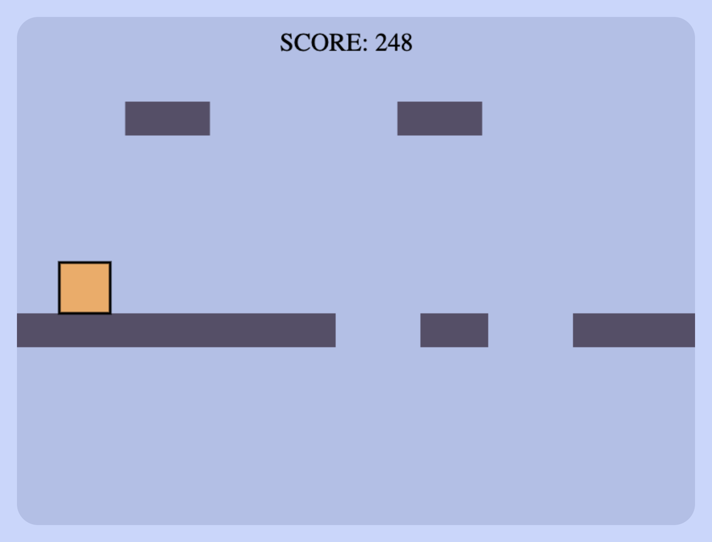
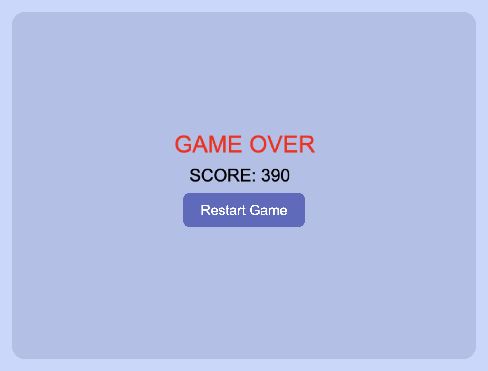

# Keep It Up!

A browser-based drag-and-drop platform game built with JavaScript and HTML5 Canvas.

This project was developed as part of a university coursework assignment and focuses on real-time gameplay mechanics, collision logic and interactive drag-and-drop systems.

---

## Live Demo

[Play the Game](https://umkhanov.github.io/keep-it-up-game/)

---

## Demo Video

[Watch Gameplay Video](https://youtu.be/lpqCXSgEv98)

---

## Gameplay

The player must prevent the square character from falling by dragging floating blocks into gaps on the platform.

As the game speed increases, the player must react quickly and place the blocks accurately.

---

## Features

- Real-time gameplay loop
- Drag-and-drop mechanics
- HTML5 Canvas rendering
- Dynamic platform generation
- Collision and support detection
- Score tracking
- Sound effects and background music
- Restart system
- Game over state management

---

## Technologies Used

- HTML5
- CSS3
- JavaScript
- HTML5 Canvas API

---

## Screenshots

<p align="center">
  
  
</p>

---

## Project Structure

```text
keep-it-up-game/
│
├── assets/
│   ├── bg.mp3
│   ├── fall.mp3
│   └── place.mp3
│
├── screenshots/
│   ├── gameplay.png
│   └── game-over.png
│
├── index.html
├── style.css
├── game.js
├── README.md
└── .gitignore
```

---

## Core Mechanics

### Platform System
- Random platform gaps are generated dynamically
- The player must place missing blocks correctly

### Drag and Drop
- Floating blocks can be dragged using the mouse
- Blocks snap into valid gap positions

### Collision Detection
- The game continuously checks:
  - platform support
  - falling state
  - gap detection

### Scoring
- Score increases over time while the player survives

---

## Educational Purpose

This project was developed to practice:
- JavaScript game logic
- Canvas rendering
- Event handling
- Interactive UI mechanics
- Real-time state updates

---

## Inspired By

[Keep It UP!](https://tinylittlestudio.itch.io/keep-it-up)

---

## Author

Magomed Umkhanov  
Computer Engineering Student